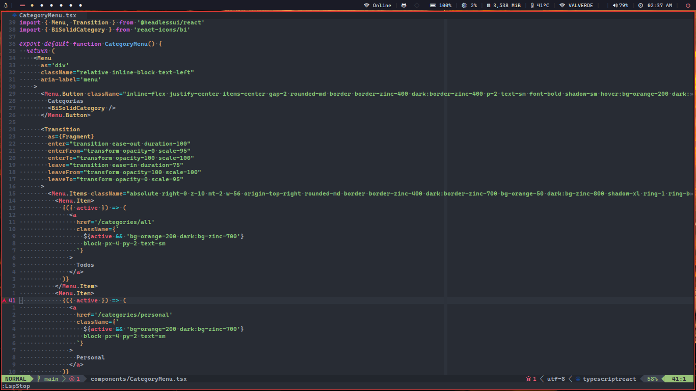

<h2 align="center">Yoel Valverde</h2>

<p align="center">
  
  
</p>

-----

Explore my personal web portfolio, an experience powered by the latest technologies: Astro and TypeScript. Dive into my digital world and discover more about my skills and projects! 🚀

> [https://yoelvalverde.dev](https://yoelvalverde.dev)

--------





## Installation

```bash
git clone https://github.com/yoelvp/yoelvp-homepage.git
```

```bash
cd yoelvp-homepage
```

```bash
bun install
```

```bash
bun run dev
```


## License
This project is licensed under the terms [MIT License](./LICENSE)
