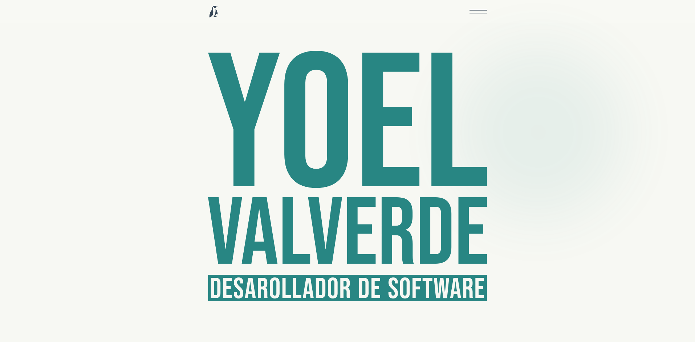
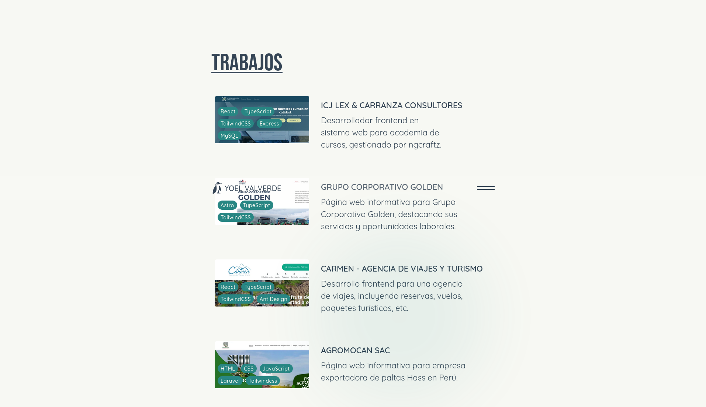
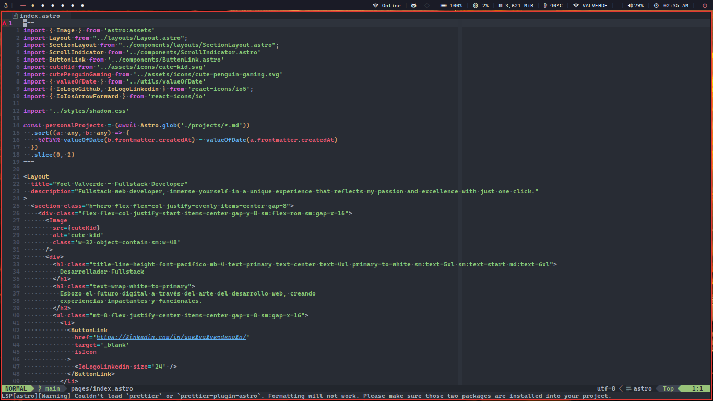
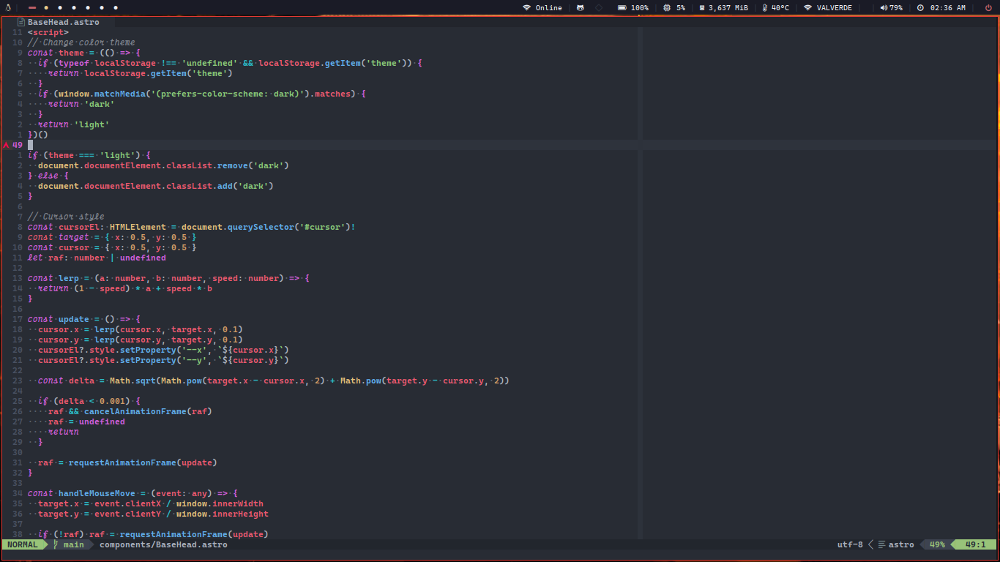

<h1>
    
    Yoel Valverde
</h1>

  
  
  

-----

Explore my personal web portfolio, an experience powered by the latest technologies: Astro and TypeScript. Dive into my digital world and discover more about my skills and projects! 🚀

> ![INFO]
> [https://yoelvalverde.dev](https://yoelvalverde.dev)

--------

## License
This project is licensed under the terms [MIT License](./LICENSE)
